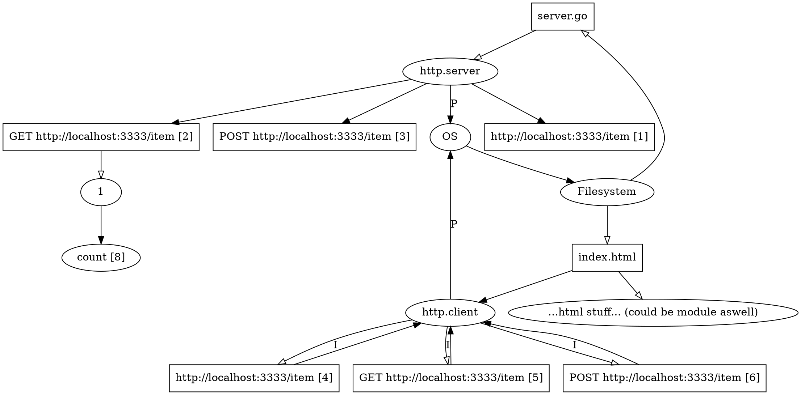

# Example 1

Simple fullstack app with bidirectional client-server communication.
Golang serves the page, JS fetches state and posts update request to server on button press.
Server serves update request, updates state. JS fetches updated state.

## Required environment

TODO

## Extracted data

### Rename

## Languages

- HTML
- JS (in HTML)
- Golang https://github.com/robertkrimen/otto

## Covered paradigms

- Multi-paradigm (JS)
- Markup

## Represented domains

- Web

## Expected scenarios

- [Rename](https://microsoft.github.io/language-server-protocol/specifications/lsp/3.17/specification/#textDocument_rename)
- [Find References](https://microsoft.github.io/language-server-protocol/specifications/lsp/3.17/specification/#textDocument_references)
- [Goto Declaration](https://microsoft.github.io/language-server-protocol/specifications/lsp/3.17/specification/#textDocument_declaration)
- [Goto Definition](https://microsoft.github.io/language-server-protocol/specifications/lsp/3.17/specification/#textDocument_definition)